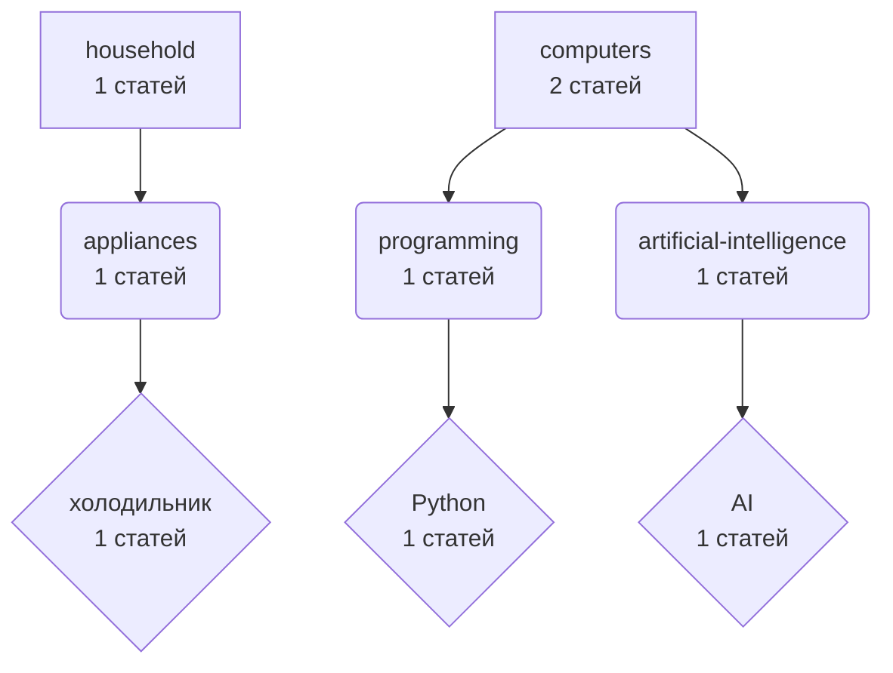

# 🌳 Диаграмма таксономии

```mermaid
graph TD
    node1["household<br/>1 статей"]
    node2("appliances<br/>1 статей")
    node1 --> node2
    node3{холодильник<br/>1 статей}
    node2 --> node3
    node4["computers<br/>2 статей"]
    node5("programming<br/>1 статей")
    node4 --> node5
    node6{Python<br/>1 статей}
    node5 --> node6
    node7("artificial-intelligence<br/>1 статей")
    node4 --> node7
    node8{AI<br/>1 статей}
    node7 --> node8
```
