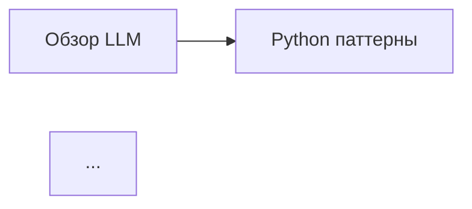

# Справочник по инструментам автоматизации

## Быстрая навигация

| Инструмент | Назначение | Использование |
|------------|-----------|---------------|
| `update_indexes.py` | Обновление индексов | `python tools/update_indexes.py` |
| `validate.py` | Валидация структуры | `python tools/validate.py` |
| `process_inbox.py` | Обработка входящих | `python tools/process_inbox.py` |
| `find_duplicates.py` | Поиск дубликатов | `python tools/find_duplicates.py` |
| `find_related.py` | Поиск связанных статей | `python tools/find_related.py <файл>` |
| `generate_statistics.py` | Генерация статистики | `python tools/generate_statistics.py` |
| `build_graph.py` | Построение графа знаний | `python tools/build_graph.py` |

---

## update_indexes.py

### Описание
Автоматически сканирует все статьи в базе знаний и обновляет индексные файлы.

### Что делает
- Сканирует все markdown файлы
- Извлекает метаданные (frontmatter)
- Обновляет статистику в INDEX.md каждой категории
- Обновляет главный INDEX.md
- Подсчитывает количество статей, подразделов

### Использование
```bash
python tools/update_indexes.py
```

### Когда использовать
- После добавления новых статей
- После изменения структуры
- Перед коммитом изменений
- Регулярно (раз в неделю)

### Пример вывода
```
🔄 Обновление индексов базы знаний...

📊 computers: найдено 15 статей
✅ Индекс обновлен: knowledge/computers/index/INDEX.md

📊 household: найдено 8 статей
✅ Индекс обновлен: knowledge/household/index/INDEX.md

📊 Общая статистика:
   Категорий: 3
   Всего статей: 25

✅ Главный индекс обновлен
✅ Все индексы обновлены!
```

---

## validate.py

### Описание
Проверяет корректность структуры базы знаний и метаданных.

### Что проверяет
- Наличие обязательных метаданных (title, date, tags, category)
- Формат метаданных (YAML)
- Корректность ссылок (битые ссылки)
- Соглашения об именовании файлов
- Структуру директорий

### Использование
```bash
python tools/validate.py
```

### Когда использовать
- Перед коммитом
- После массового добавления статей
- При подозрении на ошибки
- В CI/CD pipeline

### Типы проверок

**Ошибки (критичные):**
- Отсутствует frontmatter
- Битые ссылки
- Отсутствуют обязательные поля
- Некорректный YAML

**Предупреждения (некритичные):**
- Мало тегов (<3)
- Неверный формат даты
- Кириллица в именах файлов
- Пробелы в именах файлов

### Пример вывода
```
🔍 Начинаю валидацию базы знаний...

================================================
📋 ОТЧЕТ О ВАЛИДАЦИИ БАЗЫ ЗНАНИЙ
================================================

📊 Статистика:
   Всего статей: 25
   С frontmatter: 23
   С хорошими тегами (3+): 20
   Покрытие метаданными: 92.0%

❌ Ошибки (2):
   ❌ knowledge/computers/old-article.md: Битая ссылка на ../missing.md

⚠️  Предупреждения (3):
   ⚠️  knowledge/household/новая-статья.md: Кириллица в имени файла

================================================
❌ ВАЛИДАЦИЯ ЗАВЕРШЕНА С ОШИБКАМИ
================================================
```

---

## process_inbox.py

### Описание
Автоматически анализирует файлы в `inbox/raw/` и предлагает категоризацию.

### Что делает
- Сканирует файлы в inbox/raw/
- Анализирует содержимое (keyword-based)
- Предлагает категорию
- Извлекает ключевые слова
- Оценивает размер материала
- Создает отчет об обработке

### Использование
```bash
python tools/process_inbox.py
```

### Когда использовать
- Когда есть новые файлы в inbox/raw/
- Для первичной обработки материалов
- Перед ручной категоризацией

### Пример вывода
```
🔄 Начинаю обработку входящих материалов...

📄 Обработка: 2026-01-02-docker-article.md
📂 Предложенная категория: computers
🏷️  Ключевые слова: docker, container, kubernetes, deployment, orchestration
📊 Размер: 450 строк, 2500 слов
💡 Рекомендация: article_with_sections
📑 Найденные заголовки:
   - What is Docker
   - Container vs VM
   - Docker Compose
   - Best Practices

✅ Обработано файлов: 1
📝 Отчет сохранен: inbox/processing_report.yaml
```

---

## find_duplicates.py

### Описание
Ищет дубликаты и похожую информацию в базе знаний.

### Что ищет
- Статьи с общими тегами
- Статьи с похожими заголовками
- Дубликаты по содержимому (>70% схожести)

### Использование
```bash
python tools/find_duplicates.py
```

### Когда использовать
- Перед добавлением новой статьи
- При подозрении на дубликаты
- Регулярно (раз в месяц)
- При рефакторинге базы знаний

### Пример вывода
```
🔍 Поиск дубликатов и похожих статей...
📊 Найдено статей: 25

🏷️  Статьи с общими тегами:

   Тег: python
     - knowledge/computers/articles/programming/python-patterns.md
     - knowledge/computers/articles/programming/python-basics.md
     - knowledge/computers/articles/ai/python-ml.md

📝 Статьи с похожими заголовками:

   Паттерны проектирования в Python
   Python паттерны для начинающих
   Общие слова: python, паттерны

🔄 Возможные дубликаты по содержимому (>70% схожести):
   Не найдено

✅ Анализ завершен!
```

---

## find_related.py

### Описание
Находит статьи, связанные с указанной статьей.

### Критерии связи
- Общие теги (вес: 10 за тег)
- Та же категория (вес: 5)
- Та же подкатегория (вес: 3)
- Упоминание в тексте (вес: 15)

### Использование
```bash
python tools/find_related.py knowledge/computers/articles/ai/llm-overview-2026.md
```

### Когда использовать
- При создании новой статьи
- Для добавления секции "См. также"
- Для улучшения связности базы знаний

### Пример вывода
```
📄 Целевая статья: Обзор LLM моделей 2026
🏷️  Теги: AI, LLM, машинное-обучение, нейронные-сети, GPT
📂 Категория: computers / artificial-intelligence

🔗 Найдено 12 связанных статей

Топ связанных статей:
==================================================

1. Применение ИИ в разработке ПО
   Файл: knowledge/computers/articles/ai/ai-in-development.md
   Релевантность: 35
   Причины: 3 общих тегов: AI, ML, разработка, та же категория, та же подкатегория
   Теги: AI, ML, разработка, автоматизация, кодирование

2. Паттерны проектирования в Python
   Файл: knowledge/computers/articles/programming/python-patterns.md
   Релевантность: 15
   Причины: есть упоминание
   Теги: Python, паттерны, ООП, архитектура

==================================================

💡 Предложение: добавить в секцию 'См. также':

- [[ai-in-development.md]] - Применение ИИ в разработке ПО
- [[python-patterns.md]] - Паттерны проектирования в Python
```

---

## generate_statistics.py

### Описание
Генерирует подробную статистику по базе знаний.

### Типы статистики
- Общая (количество статей, слов, тегов)
- По категориям (распределение, средние значения)
- По тегам (топ тегов, уникальные)
- Метрики качества (покрытие метаданными, ссылки)
- Топ статей (самые длинные, самые связанные)

### Использование
```bash
python tools/generate_statistics.py
```

### Когда использовать
- Для анализа состояния базы знаний
- Перед отчетами о прогрессе
- При планировании развития
- Регулярно (раз в месяц)

### Вывод
Консольный отчет + JSON файл `statistics.json`

### Пример вывода
```
================================================================================
📊 СТАТИСТИКА БАЗЫ ЗНАНИЙ
================================================================================

📈 Общая статистика:
   Всего статей: 25
   Всего слов: 45,320
   Среднее слов на статью: 1,813
   Среднее тегов на статью: 4.2
   Покрытие метаданными: 92.0%

📁 По категориям:
   computers:
      Статей: 15
      Слов: 28,540
      Подкатегорий: 8

   household:
      Статей: 8
      Слов: 14,230
      Подкатегорий: 6

🏷️  Теги:
   Уникальных тегов: 78
   Топ-10 тегов:
      python: 8
      AI: 6
      бытовая-техника: 5
      программирование: 5
      docker: 4

✅ Качество:
   С хорошими тегами (3+): 23
   Со ссылками: 18
   С примерами кода: 12
   Распределение по размеру:
      Короткие (<100 слов): 2
      Средние (100-500 слов): 8
      Длинные (>500 слов): 15

🏆 Топ статей:
   Самые длинные:
      Руководство по выбору холодильника 2026: 4,523 слов
      Обзор LLM моделей 2026: 3,215 слов
      Паттерны проектирования в Python: 2,987 слов

================================================================================

📝 Статистика сохранена в: statistics.json
```

---

## build_graph.py

### Описание
Строит граф знаний из статей и связей между ними.

### Что создает
- Узлы (статьи)
- Рёбра (ссылки между статьями)
- Связи по тегам (слабые связи)

### Форматы экспорта
- **JSON** - для программной обработки
- **DOT** (Graphviz) - для визуализации
- **Mermaid** - для встраивания в markdown

### Использование
```bash
python tools/build_graph.py
```

### Когда использовать
- Для визуализации структуры знаний
- Для анализа связности
- Для поиска изолированных статей
- Для определения центральных статей (hub'ов)

### Пример вывода
```
🔗 Построение графа знаний...

   Создано узлов: 25
   Создано рёбер: 47

📊 Анализ графа:
   Изолированных узлов: 3

   Топ hub'ов (центральные статьи):
      Паттерны проектирования в Python: 8 связей
      Обзор LLM моделей 2026: 6 связей
      Docker основы: 5 связей
      Kubernetes для начинающих: 4 связи

✅ Граф сохранён: knowledge_graph.json
✅ DOT файл сохранён: knowledge_graph.dot
   Используйте: dot -Tpng knowledge_graph.dot -o graph.png
✅ Mermaid файл сохранён: knowledge_graph.mmd

🎉 Граф знаний построен!
```

### Визуализация графа

**Graphviz:**
```bash
dot -Tpng knowledge_graph.dot -o graph.png
dot -Tsvg knowledge_graph.dot -o graph.svg
```

**Mermaid:**
Вставить содержимое `knowledge_graph.mmd` в markdown:
````markdown

````

---

## Рабочие процессы (Workflows)

### Добавление новой статьи

```bash
# 1. Создать статью
nano knowledge/computers/articles/programming/new-article.md

# 2. Заполнить метаданные по шаблону
# (см. docs/TEMPLATES.md)

# 3. Найти связанные статьи
python tools/find_related.py knowledge/computers/articles/programming/new-article.md

# 4. Добавить ссылки в секцию "См. также"

# 5. Обновить индексы
python tools/update_indexes.py

# 6. Валидировать
python tools/validate.py

# 7. Закоммитить
git add .
git commit -m "[computers] Добавлена статья про new-article"
git push
```

### Обработка входящих материалов

```bash
# 1. Поместить файлы в inbox/raw/

# 2. Запустить обработку
python tools/process_inbox.py

# 3. Просмотреть отчет
cat inbox/processing_report.yaml

# 4. Создать статьи на основе рекомендаций

# 5. Переместить обработанные в inbox/processed/
mv inbox/raw/file.md inbox/processed/
```

### Регулярное обслуживание

```bash
# Еженедельно
python tools/update_indexes.py
python tools/validate.py

# Ежемесячно
python tools/find_duplicates.py
python tools/generate_statistics.py

# Раз в квартал
python tools/build_graph.py
# Анализировать граф для выявления пробелов в знаниях
```

---

## CI/CD (GitHub Actions)

Автоматическая валидация при каждом коммите:

`.github/workflows/knowledge-base-ci.yml`:
- Проверка структуры
- Валидация метаданных
- Поиск дубликатов
- Проверка качества
- Генерация статистики

Запускается автоматически при push и PR.

---

## Требования

**Python 3.7+**

**Библиотеки:**
```bash
pip install pyyaml
```

**Опционально (для расширенных функций):**
```bash
# Граф знаний
pip install networkx matplotlib

# Семантический поиск
pip install sentence-transformers scikit-learn

# NLP
pip install transformers

# Веб-скрапинг
pip install beautifulsoup4 requests feedparser
```

---

## Полезные команды

### Поиск

```bash
# Найти все статьи с тегом "Python"
grep -r "tags:.*Python" knowledge/

# Найти статьи по ключевому слову
grep -ri "docker" knowledge/ --include="*.md"

# Найти все индексы
find knowledge/ -name "INDEX.md"

# Подсчитать статьи по категориям
find knowledge/computers/articles -name "*.md" | wc -l
find knowledge/household/articles -name "*.md" | wc -l
```

### Git

```bash
# Статус базы знаний
git status

# Посмотреть изменения
git diff knowledge/

# Добавить и закоммитить
git add .
git commit -m "[category] Description"
git push
```

---

## Troubleshooting

### Ошибка: "Module not found: yaml"
```bash
pip install pyyaml
```

### Ошибка: "Permission denied"
```bash
chmod +x tools/*.py
```

### Скрипт не находит файлы
Убедитесь, что запускаете из корня репозитория:
```bash
cd /path/to/data20
python tools/script_name.py
```

### Битые ссылки после переименования файла
```bash
# Найти все ссылки на старое имя
grep -r "old-name.md" knowledge/

# Заменить вручную или через sed
find knowledge/ -name "*.md" -exec sed -i 's/old-name\.md/new-name.md/g' {} \;
```

---

## Расширенные идеи

Смотрите `docs/ADVANCED_IDEAS.md` для:
- Интеграции с AI (LLM API)
- Семантического поиска
- Автоматической категоризации
- Графа знаний с визуализацией
- Мультиязычности
- И многого другого!

---

**Последнее обновление:** 2026-01-02
